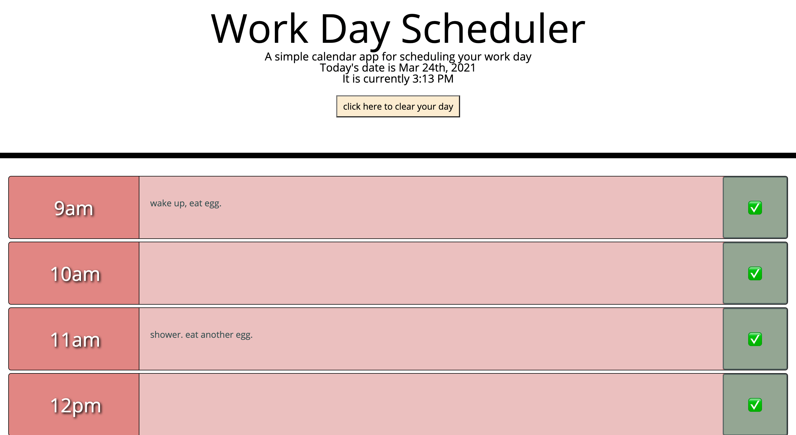

# Forest Wilson - Homework 5 - Work Day Schedular
MIT - (https://opensource.org/licenses/MIT) - For Good.
<!-- Original deployment date: March 24th, 2021 -->

## Table of Contents:
- [This week's concepts](#this-weeks-concepts)
- [Tech used](#tech-used)
- [Project description](#project-description)
- [Usage instructions](#usage-instructions)
- [Project installation](#project-installation)
- [Additional comments](#additional-comments)
- [Contribution information](#contribution-information)
- [Questions](#questions-or-concerns)
- [Extras](#extras)

### About This Project

* # This weeks concepts:
  1. Link CDNs
  2. JQuery
  3. Moment.js
  4. Local storage

* # Tech used:
  1. HTML
  2. CSS
  3. JavaScript
  4. JQuery

* # Project description:
  Given a need to track my busy schedule, I created an app that lets you schedule activities throughout the day, hour by hour. Uses moment.js to keep track of the current time, and shows visually where you are at in the day.

* # Usage instructions
  Fill out each hour's field to keep track of events moment-by-moment. Color coordinated to show you where you are in the day; red are hours passed, green is the current hour, and grey are hours later in the day. You may also edit an hour's activities, or clear your day entirely.

* # Project installation
  1. Visit the deployment link
  2. Fill out your hourly events 
  3. Enjoy.
     
* # Additional comments
(Mar/24/21)  

  - I explained my use of Index + 9 in the js comments, but basically it was a hacky way to assign my list element time position and compare it to the current hour.

  - Part of my functions that are based on the current time were difficult to test becuase I couldn't find out how to manipulate the time in the chrome devtools to confirm functionality. if you know a good way for me to test this apart from adding adding more to my index in the if function please let me know!

  - I wanted to create functionality where if a new day starts, the page will automatically clear all events and start you with a fresh sheet, but I was unsure how/where I could put this, and without the ability to test at certain times I didnt know how I could confirm that it works, so instead I opted to create a button that clears all events for when you want to start a new day.

  - Although the time displayed on the webpage is correct, it does not change until you refresh the page. Further testing required.

#### Contribution information 

- If you would like to contribute to this project, please follow best practices and message me at one of the provided contacts bellow if you want to push!

###### Questions or concerns? 
* Please contact me at one of the following!

  Email - Hexaforest@gmail.com
  gitHub - https://github.com/ForestW70/

# Extras

* Screenshots:
  - 

* Links:
  - [Repo page](https://github.com/ForestW70/hw5workdayscheduler)
  - [Deployed page](https://forestw70.github.io/hw5workdayscheduler/)